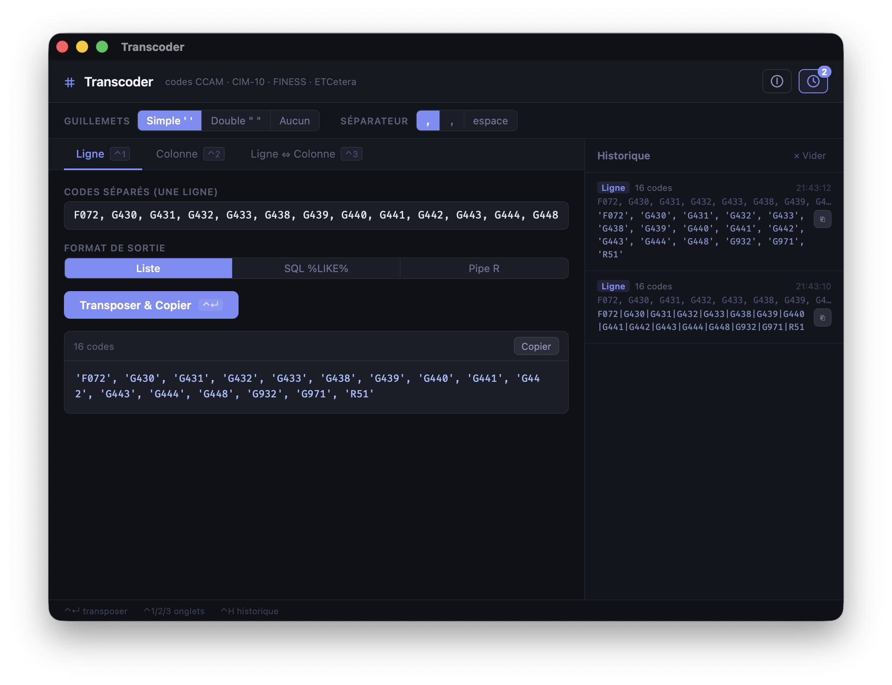

# Transcoder 

**Convertir rapidement des listes de codes/items en ligne, en colonne, pour le `SQL%` et `pipe|` de R**


- formater des listes pour le code / requêtage de données (clause where, filter, regexp)
- conversions entre format lisible (méthodo) et format pour le code
(avec quote, avec pipe, pour le SQL)
- transposer des listes de codes/items en colonnes et vice-versa

**app bureau Tauri + SvelteKit + Rust**

Port de la Shiny app [stringfix/transcoder](https://guillaumepressiat.shinyapps.io/transcodeur/) cf code [ici](https://github.com/GuillaumePressiat/stringfix/tree/master/inst/transcoder/transcoder) en application bureau native.




## Stack

| Couche    | Techno                      |
|-----------|-----------------------------|
| Frontend  | SvelteKit 2 + Svelte 5      |
| Backend   | Rust (logique de transcodage) |
| Shell     | Tauri 2                     |
| Clipboard | tauri-plugin-clipboard-manager |


## Installation

```bash
# Cloner / décompresser le projet
cd transcoder

# Dépendances JS
npm install

# Lancement en dev (hot-reload)
npm run tauri dev

# Build production (binaire + installeur)
npm run tauri build
# → src-tauri/target/release/transcoder  (binaire)
# → src-tauri/target/release/bundle/     (installeurs .deb/.AppImage/.msi/.dmg)
```

## Fonctionnalités

### Onglet 1 – Ligne

Colle une ligne de codes séparés → reformatage en :
- **Liste** : `'F072', 'G430', 'G431'`
- **SQL %LIKE%** : `'%F072%' | \n'%G430%'`
- **Pipe R** : `F072|G430|G431`

### Onglet 2 – Colonne

Même chose depuis une colonne (un code par ligne).

### Onglet 3 – Ligne ⇔ Colonne

Conversion dans les deux sens.

### Options globales

- Guillemets : simple `'`, double `"`, aucun
- Séparateur : `, ` / `,` / espace

### Extras vs Shiny

- **Copie automatique** dans le presse-papier à chaque transformation
- **Historique** des 50 dernières transformations (panneau latéral)
- **Raccourcis clavier** :
  - `Ctrl+Entrée` → lancer la transformation active
  - `Ctrl+1/2/3` → changer d'onglet
  - `Ctrl+H` → afficher/masquer l'historique

## Structure du projet

```
transcoder/
├── src/                        # Frontend SvelteKit
│   ├── app.html
│   ├── lib/
│   │   ├── api.js              # Wrappers invoke() → Rust
│   │   ├── history.js          # Store Svelte pour l'historique
│   │   └── About.svelte        # à propos
│   └── routes/
│       ├── +layout.js          # SSR désactivé (requis Tauri)
│       ├── +layout.svelte
│       └── +page.svelte        # UI principale (tabs + history)
├── src-tauri/
│   ├── Cargo.toml
│   ├── tauri.conf.json
│   ├── capabilities/
│   │   └── default.json        # Permissions Tauri v2
│   └── src/
│       ├── main.rs             # Entrée binaire
│       └── lib.rs              # Logique Rust + commandes Tauri
├── package.json
├── svelte.config.js
└── vite.config.js
```

## Notes sur le portage Rust

La fonction R `enrobeur()` est portée exactement :
- `enrobeur(items, robe, colonne=F, interstice)` → `fn enrobeur(items, quote, sep, output_type)`
- Le cas `symetrique=T` (SQL) produit `'%code%'` via ouverture/fermeture asymétrique
- `str_split` + `flatten_chr` → `split()` + `filter()`
